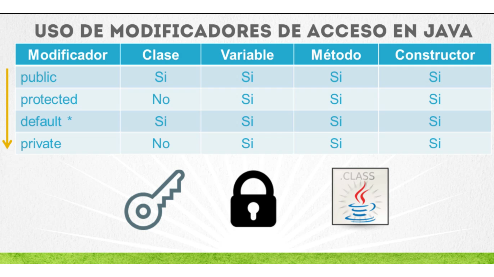
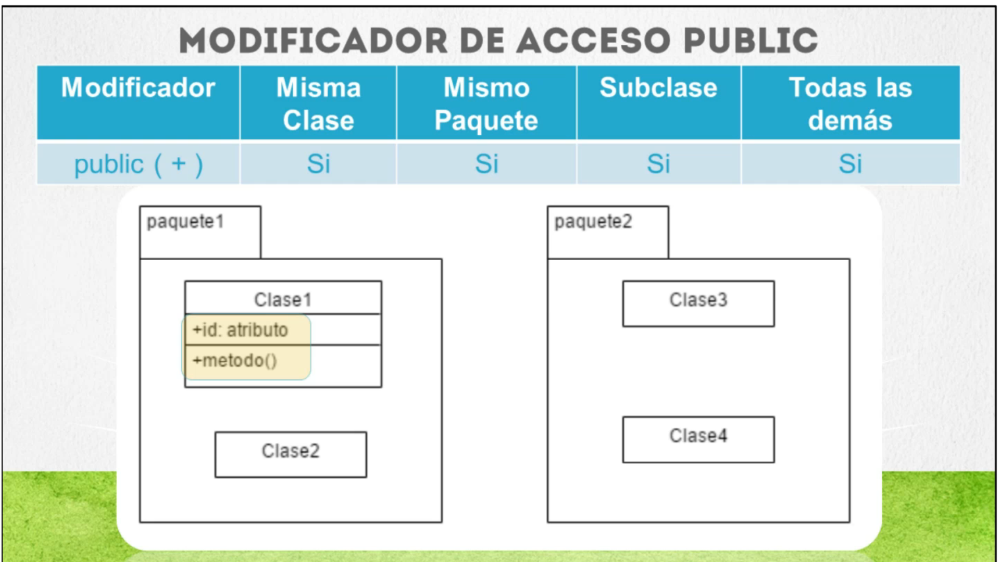
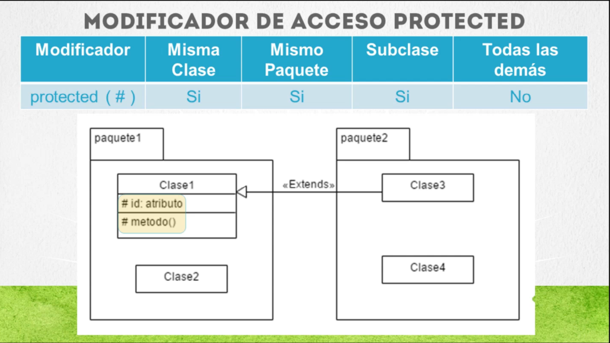
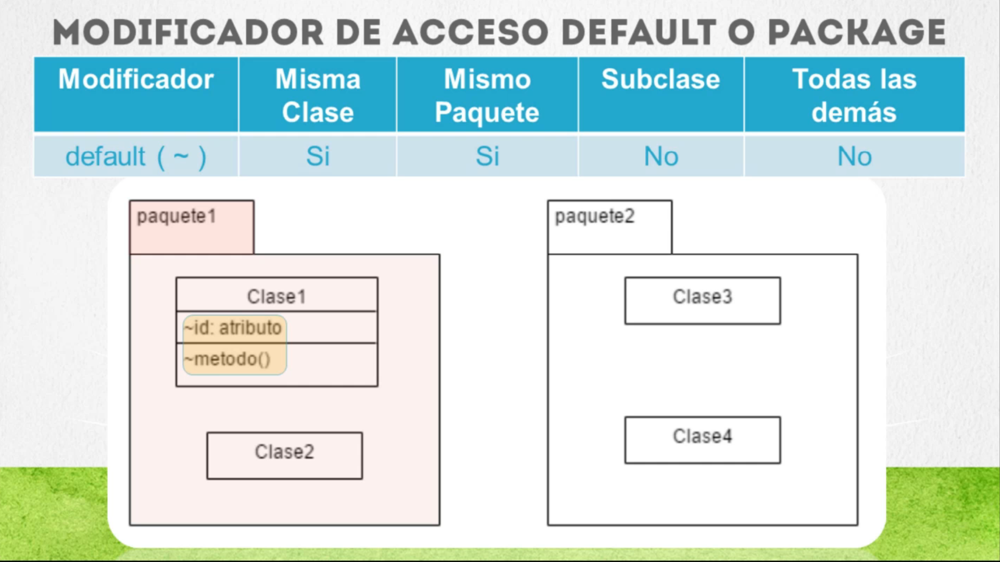
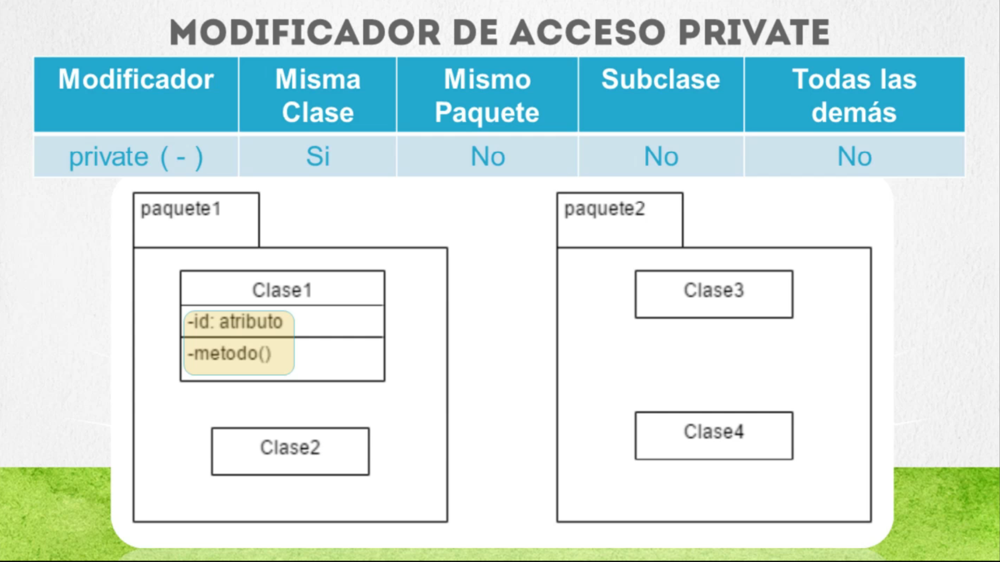

# Información Adicional - Clase 03

Este archivo contiene información adicional sobre la clase 03 de Java.

## Temas Cubiertos

- Conceptos avanzados de programación orientada a objetos.
- Uso de forEach.
- Introducción a Autoboxing y Unboxing.
- Manejo de Modificadores de acceso.
- Uso de la palabra reservada `this`.
- Ejemplos de uso de `this` en métodos y constructores.

## Recursos Adicionales

- [Documentación oficial de Java](https://docs.oracle.com/javase/8/docs/)
- [Guía de programación orientada a objetos](https://www.geeksforgeeks.org/object-oriented-programming-oops-concept-in-java/)
- [¿Qué es la caché y cómo se usa en la programación? (guía completa)](https://ed.team/blog/que-es-la-cache-y-como-se-usa-en-la-programacion-guia-completa?utm_source=sendinblue&utm_campaign=_Newsletter_34__Qu_es_la_cach_y_cmo_se_usa_en_la_programacin_-_NO_Premium&utm_medium=email)
- [¿Qué es Docker y Kubernetes?](https://www.youtube.com/watch?v=gjRoNFopFig)
- [¿Qué es un contenedor?](https://www.youtube.com/watch?v=2z0g1a5v4xA)
- [¿Qué es un microservicio?](https://www.youtube.com/watch?v=2z0g1a5v4xA)
- [¿Qué es un API REST?](https://www.youtube.com/watch?v=2z0g1a5v4xA)
- [Quiénes necesitan aprender ciberseguridad en tu empresa](https://www.youtube.com/watch?v=vTUnItysHFQ)

## Ejercicios Propuestos

1. Crear una jerarquía de clases utilizando herencia.
2. Implementar una interfaz en una clase concreta.
3. Diseñar un programa que utilice polimorfismo para resolver un problema práctico.
4. Crear una clase que utilice Autoboxing y Unboxing para manejar colecciones de datos.
5. Implementar un método que utilice `forEach` para recorrer una lista de objetos y aplicar una operación a cada uno de ellos.
6. Investigar sobre el uso de la palabra reservada `super` en Java.
7. Crear un programa que utilice la palabra reservada `this` para diferenciar entre variables de instancia y parámetros de método.
8. Diseñar un programa que utilice modificadores de acceso para controlar la visibilidad de las variables y métodos de una clase.
9. Investigar sobre el uso de excepciones en Java para manejar errores y situaciones inesperadas.
10. Crear un programa que utilice excepciones personalizadas para manejar errores específicos en la lógica de negocio.

## Imagenes de Ejemplo de la clase

  
  
  

## Notas

- Es importante seguir las buenas prácticas.
- Si tienes dudas, consulta con la documentación oficial de Java (https://docs.oracle.com/javase/8/docs/) o revisa los recursos compartidos.
- La práctica es fundamental para dominar los conceptos de programación orientada a objetos y Java en general.
