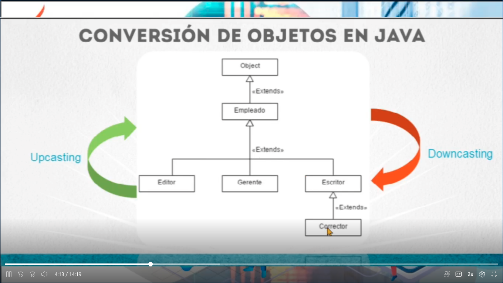
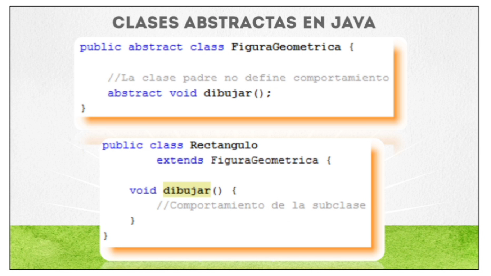

# Información Adicional - Clase 05

Este archivo contiene información adicional sobre la clase 05 de Java.

## Temas Cubiertos

-Casting
    -Downcasting
    -Upcasting
-Equals
-Hashcode
-Clases Abstractas

## Recursos Adicionales de la Clase 05
- [TypeCasting W3Schools](https://www.w3schools.com/java/java_type_casting.asp)
- [DownCasting GeeksForGeeks](https://www.geeksforgeeks.org/rules-of-downcasting-objects-in-java/)
- [UpCasting GeeksForGeeks](https://www.geeksforgeeks.org/upcasting-in-java-with-examples/)
- [Blog HashCode()](https://www.baeldung.com/java-hashcode)
- [Blog Equals()](https://medium.com/@AlexanderObregon/javas-objects-equals-method-explained-3a84c963edfa)
- [Abstraccion W3Schools](https://www.w3schools.com/java/java_abstract.asp)

## Lectura adicional de la Clase 05
- [Typescript](https://ed.team/blog/que-es-typescript-y-por-que-debes-aprenderlo?utm_source=sendinblue&utm_campaign=%20Newsletter%2046%20%20Qu%20es%20TypeScript%20-%20no%20Premium%20y%20segmentos&utm_medium=email)

## Imagenes de Ejemplo de la clase

  
  