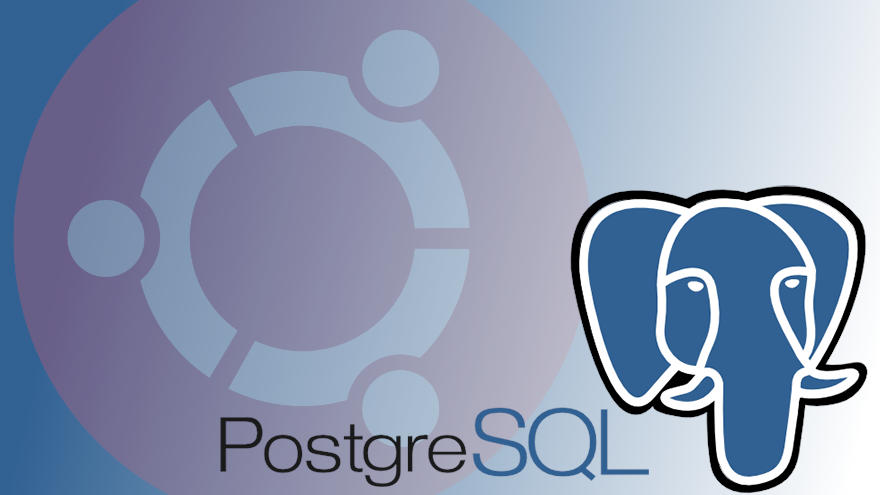
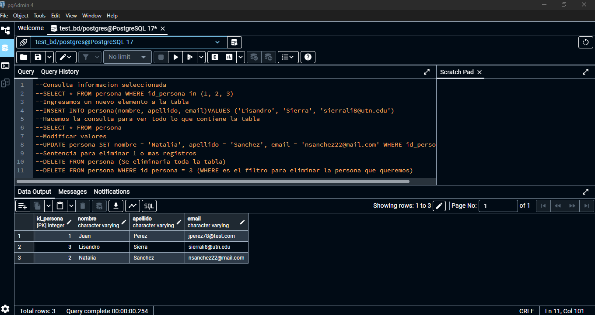

# Clase 04 - Python con PostgreSQL

Este repositorio contiene el material correspondiente a la **Clase 04** de de Python, donde se aborda la integración de Python con bases de datos PostgreSQL.




## Contenido

- Introducción a PostgreSQL
- Conexión de Python con PostgreSQL utilizando `psycopg2`
- Ejecución de consultas SQL desde Python
- Manejo de errores y transacciones
- Ejercicios prácticos

## Requisitos

Antes de comenzar, asegúrate de tener instalados los siguientes componentes:

- Python 3.x
- PostgreSQL
- Biblioteca `psycopg2` (puedes instalarla con `pip install psycopg2`)

## Configuración

1. Configura una base de datos PostgreSQL local o remota.
2. Actualiza los parámetros de conexión en el archivo de configuración del proyecto.

## Ejemplo de Conexión

```python
import psycopg2

try:
    connection = psycopg2.connect(
        host="localhost",
        database="nombre_base_datos",
        user="usuario",
        password="contraseña"
    )
    print("Conexión exitosa")
except Exception as e:
    print(f"Error al conectar: {e}")
finally:
    if connection:
        connection.close()
```

## Recursos Adicionales

- [Documentación oficial de PostgreSQL](https://www.postgresql.org/docs/)
- [Documentación de psycopg2](https://www.psycopg.org/docs/)

## Créditos

Material desarrollado para el curso de Python en **TUP-UTN**.

---

**Nota:** Recuerda actualizar este archivo con imágenes o ejemplos adicionales según sea necesario.
